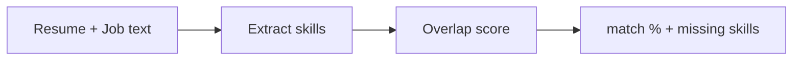

# Job-Match AI

Scores a resume against a job post by skill overlap. Returns match %, matched skills, missing skills, and a short explanation. Built for portfolio demos and interviews.

## How it works



v1 is deterministic keyword matching (no LLM). LLM scoring and embeddings are next.

## Quick start

```bash
python -m venv .venv
source .venv/bin/activate
pip install -r requirements.txt
pytest -q
uvicorn app.main:app --reload --port 8000
```

Health check: `curl http://localhost:8000/health`

Match sample:

```bash
curl -s http://localhost:8000/match \
  -H 'Content-Type: application/json' \
  -d "{\"resume\": \"$(cat samples/resume.txt)\", \"job\": \"$(cat samples/job.txt)\"}"
```

## Docker

```bash
docker build -t job-match-ai .
docker run -p 8000:8000 job-match-ai
```

## Roadmap

1. LLM enrichment for soft skills and seniority
2. Embedding-based semantic match
3. Streamlit UI
4. Deploy to Hugging Face Spaces

## License

MIT
