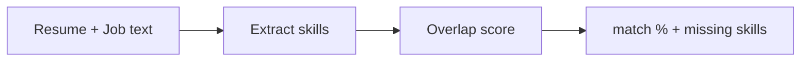

# Job-Match AI

**Live demo:** [job-match-ai-rawb.onrender.com](https://job-match-ai-rawb.onrender.com) · [API docs](https://job-match-ai-rawb.onrender.com/docs) (free tier, so the first load after idle can take ~50s)

Scores a resume against a job post by skill overlap. Returns match %, matched skills, missing skills, and a short explanation. Built for portfolio demos and interviews.

## How it works



v0.2 blends keyword matching with optional LLM judgment.

Set `OPENAI_API_KEY` or `GEMINI_API_KEY` (or `GOOGLE_API_KEY`) in the environment.
Without a key, `/match` still works with keywords only. Pass `"use_llm": false` to force keywords.

## Quick start

```bash
python -m venv .venv
source .venv/bin/activate
pip install -r requirements.txt
pytest -q
uvicorn app.main:app --reload --port 8000
```

Health check: `curl http://localhost:8000/health`

Match sample:

```bash
curl -s http://localhost:8000/match \
  -H 'Content-Type: application/json' \
  -d "{\"resume\": \"$(cat samples/resume.txt)\", \"job\": \"$(cat samples/job.txt)\"}"
```

## Deploy (Render free tier)

Deployed as a Docker web service on Render's free instance. Secrets are never committed: set `OPENAI_API_KEY` (and optional `OPENAI_MODEL`) under the service's Environment settings. Locally, copy `.env.example` to `.env`; the app loads it with `python-dotenv`.

## Docker

```bash
docker build -t job-match-ai .
docker run -p 8000:8000 job-match-ai
```

## Roadmap

1. ~~LLM enrichment~~ (done in v0.2)
2. Embedding-based semantic match
3. Streamlit UI
4. Deploy to Hugging Face Spaces

## License

MIT
